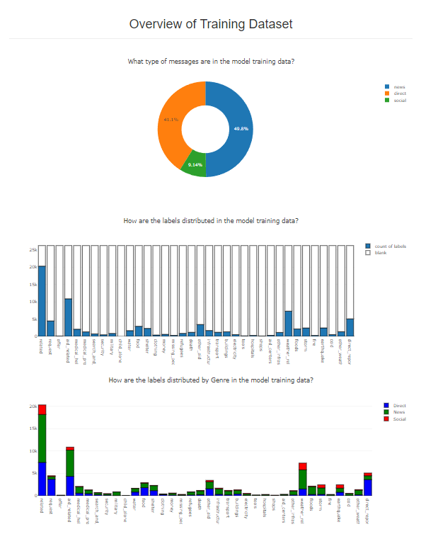
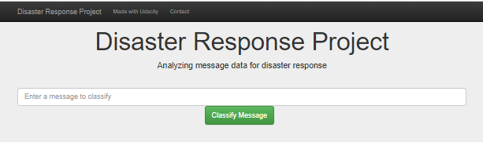
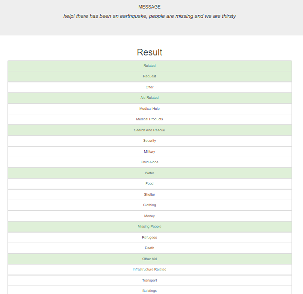

# Disaster Response Pipeline Project

This project has been completed as part of the Udacity Data Scientist NanoDegree, based on data provided by Figure Eight

The project takes pre-labelled Twitter messages from real-life disaster events. The aim is to build a Natural Language Processing model to categorise messages on a real-time basis in the event of a disaster so that scarce resources can prioritise the most urgent actions as quickly as possible. 

### Project Structure
The project is divided into the following components

1. Building an ETL pipeline to extract Twitter messages from source, clean the data and save the results in a SQLite database.
2. Building a machine learning pipeline to train a model to classify text messages into the various categories.
3. Running a web app that allows entry of a new message and then displays the modelled categorisation in real-time.

### Instructions:
1. Run the following commands in the project's root directory to set up your database and model.

    - To run ETL pipeline that cleans data and stores in database
        `python data/process_data.py data/disaster_messages.csv data/disaster_categories.csv data/DisasterResponse.db`
    - To run ML pipeline that trains classifier and saves
        `python models/train_classifier.py data/DisasterResponse.db models/classifier.pkl`

2. Run the following command in the app's directory to run your web app.
    `python run.py`

3. Go to http://0.0.0.0:3001/

### Screenshots:

#### Example of model data statistics:

#### Example of web entry:

#### Example of output:

